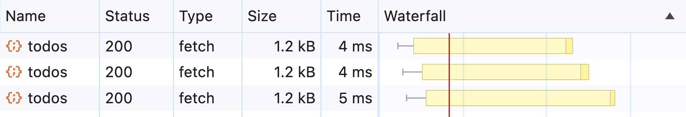
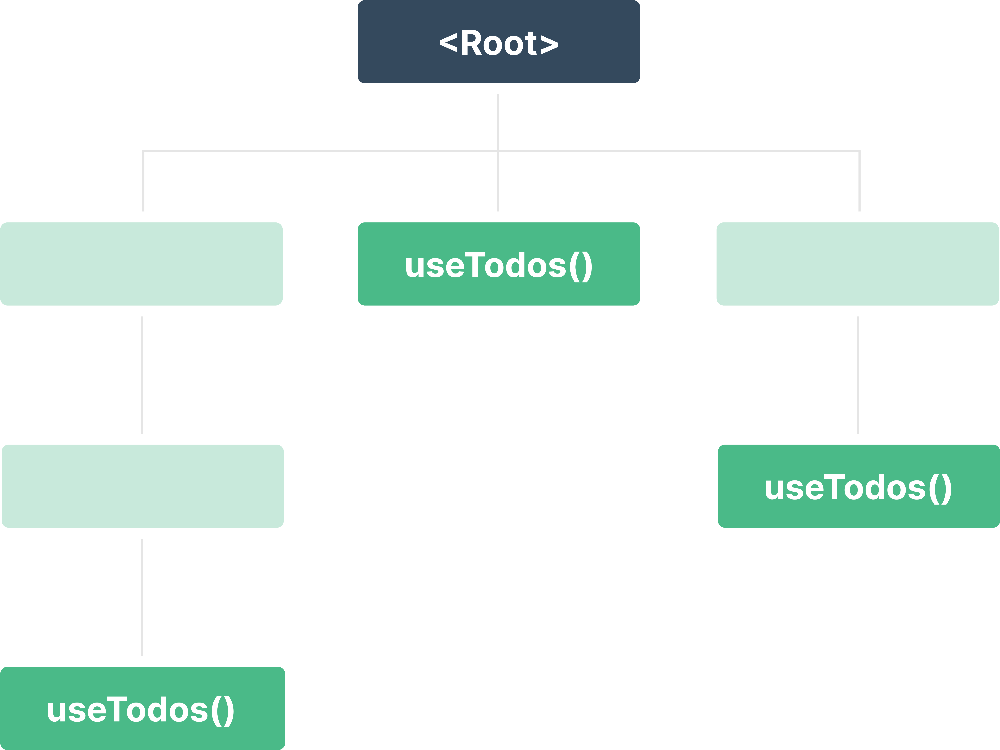
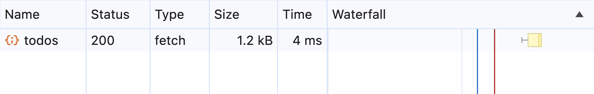
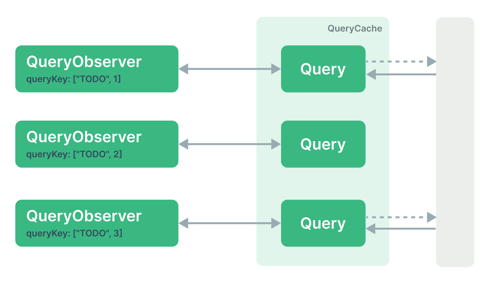
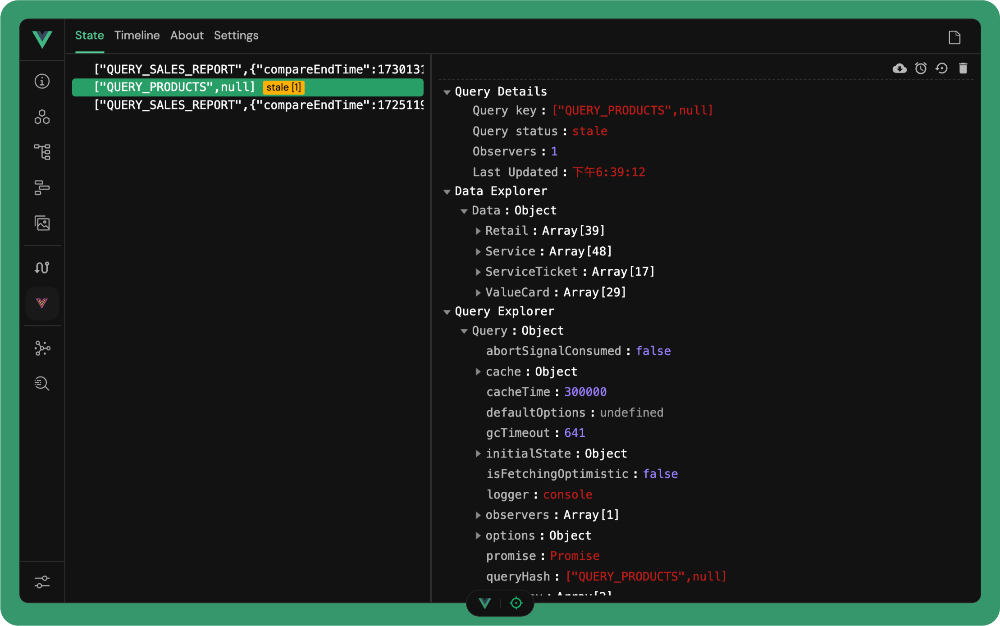
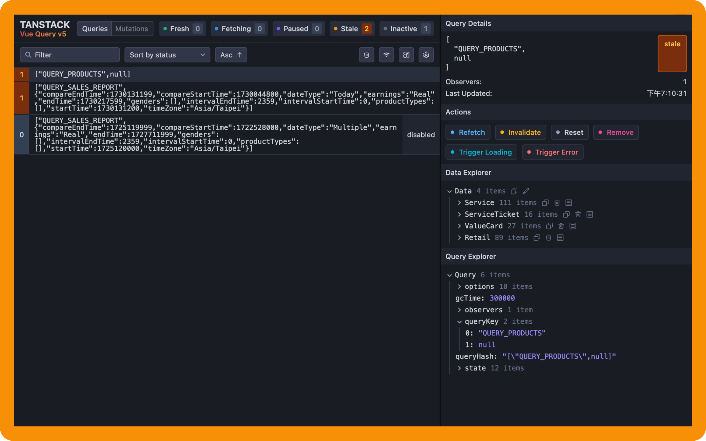

<h1 class="font-900">快速認識 TanStack <span class="text-gradient">Query</span></h1>

Alex Liu

---
class: pl-30 py-30
---

# Alex Liu

<div class="opacity-80">

- Front-End Web Developer
- TypeScript / Vue / Nuxt / <span class="opacity-15 px-1">React</span>
- <Repo name="mini-ghost/vorms" /> Owner
- <Repo name="mini-ghost/nuxt-svgo-loader" /> Owner

</div>


<div class="absolute flex items-center gap-x-4 bottom-30 text-sm">
  <div class="flex items-center space-x-1.5"><carbon-user class="opacity-40" /><a href="https://mini-ghost.dev/" target="_blank" class="border-none! font-300">mini-ghost.dev</a></div>
  <div class="flex items-center space-x-1.5"><carbon-logo-x class="opacity-40" /><a href="https://twitter.com/Minighost_Alex" target="_blank" class="border-none! font-300">@Minighost_Alex</a></div>
  <div class="flex items-center space-x-1.5"><carbon-logo-github class="opacity-40" /><a href="https://github.com/Mini-ghost" target="_blank" class="border-none! font-300">Mini-ghost</a></div>
</div>

---

# 為什麼使用 TanStack Query？

<div class="h-5" />

<div class="grid grid-cols-3 gap-2 py-4">
  <div v-click class="flex flex-col gap-1 p-4 rounded bg-violet/15 text-violet-100">
    <div class="text-2xl i-ph-globe-duotone text-violet mb-2" />
    <div>適用於各種資料擷取方式</div>
    <div class="text-xs opacity-50">支援 REST API、GraphQL、Promises 等多種資料擷取方式。</div>
  </div>

  <div v-click class="flex flex-col gap-1 p-4 rounded bg-orange/15 text-orange-100">
    <div class="text-2xl i-ph-clock-countdown-duotone text-orange mb-2" />
    <div>自動快取與重新擷取資料</div>
    <div class="text-xs opacity-50">採用 stale-while-revalidate 快取策略，優先返回快取資料並在背境更新資料。</div>
  </div>

  <div v-click class="flex flex-col gap-1 p-4 rounded bg-rose/15 text-rose-100">
    <div class="text-2xl i-ph-arrows-merge-duotone -rotate-90 text-rose mb-2" />
    <div>合併重複的請求</div>
    <div class="text-xs opacity-50">自動合併重複的 API Request，輕鬆地管理不同來源的相同請求。</div>
  </div>

  <div v-click class="flex flex-col gap-1 p-4 rounded bg-blue/15 text-blue-100">
    <div class="text-2xl i-ph-archive-duotone text-blue mb-2" />
    <div>資料持久化（Persisters)</div>
    <div class="text-xs opacity-50">資料可在網頁重新載入後自動恢復，減少等待時間，提升使用者體驗。</div>
  </div>

  <div v-click class="flex flex-col gap-1 p-4 rounded bg-green/15 text-green-100">
    <div class="text-2xl i-ph-gear-duotone text-green mb-2" />
    <div>專屬開發人員工具</div>
    <div class="text-xs opacity-50">專屬開發人員工具 (Devtools)，方便在開發過程測試與檢查資料快取與狀態。</div>
  </div>
</div>

---

# 適用於各種資料擷取方式

支援 REST API、GraphQL、Promises 等多種資料擷取方式。

<div class="grid grid-cols-2 gap-6">

````md magic-move 
```vue{*|5|6-10|*}{lines:true}
<script setup lang="ts">
import axios from 'axios'

const { data, isLoading } = useQuery({
  queryKey: ['TODOS'],
  queryFn: () => {
    return axios
      .get('/api/todos')
      .then(response => response.data)
  }
})
</script>
```

```vue{*}{lines:true}
<script setup lang="ts">
import { ofetch } from 'ofetch'

const { data, isLoading } = useQuery({
  queryKey: ['TODOS'],
  queryFn: () => {
    return ofetch('/api/todos')
  }
})
</script>
```

```vue{*}{lines:true}
<script setup lang="ts">
import request from 'graphql-request'

const TODOS_QUERY = gql`
  query TODOS_QUERY {
    todos {
      id
      title
    }
  }
`

const { data, isLoading } = useQuery({
  queryKey: ['TODOS'],
  queryFn: () => {
    return request('/graphql', TODOS_QUERY)
  }
})
</script>
```
````

<div>
  <ul class="py-4">
    <li v-click="1"><span class="bg-blue/15 text-blue rounded px-2 py-0.5">queryKey</span> 提供了一個儲存資料特定的位置。</li>
    <li v-click="2">每當我們需要擷取資料時就會執行 <span class="bg-orange/15 text-orange rounded px-2 py-0.5">queryFn</span></li>
    <li v-click="3">
      這個例子中使用了
      <span v-if="$clicks === 3" class="bg-violet/15 text-violet rounded px-2 py-0.5">axios</span>
      <span v-if="$clicks === 4" class="bg-yellow/15 text-yellow rounded px-2 py-0.5">ofetch</span>
      <span v-if="$clicks >= 5" class="bg-pink/15 text-pink rounded px-2 py-0.5">graphql-request</span>
      實現。
    </li>
  </ul>

  <span v-click="6">實際上 TanStack Query 並不在乎我們怎麼擷取資料，只要回傳是<span v-click v-mark="{ color: 'orange' }">非同步資料（Asynchronous）</span>就好。</span>
</div>


</div>

---

# 自動快取與重新擷取資料

採用 stale-while-revalidate 快取策略，優先返回快取資料並在背境更新資料


<div
  v-click
  class="relative transition-all duration-200 leading-relaxed"
  :class="{
    'translate-y-[12vh]': $clicks < 2,
  }"
>
  <span class="bg-green/15 text-green rounded px-2 py-0.5">stale-while-revalidate</span> 是一種快取策略，主要用於提升資料擷取效能與用戶體驗。它讓系統在回傳快取的「過期資料」的同時，背景中自動重新擷取最新資料，並更新快取。
</div>

<div class="py-4">
  <span v-click ><span class="bg-yellow/15 text-yellow rounded px-2 py-0.5">staleTime</span> is your Best Friend!</span>

  <div class="grid grid-cols-2 gap-6 mt-3">

  <div v-click>

  ```ts
  const queryClient = new QueryClient({
    defaultOptions: {
      queries: {
        staleTime: 1000 * 60 * 5 // 5 分鐘後重新擷取資料
      }
    }
  })
  ```

  </div>

  <div v-click>

  ```vue
  <script setup lang="ts">
  useQuery({
    queryKey,
    queryFn,
    staleTime: 1000 * 60 * 2 // 2 分鐘後重新擷取資料
  })
  </script>
  ```

  </div>

  </div>
</div>

<v-clicks>

- 當第一次發出 API 請求時，將 response cache 起來
- 當之後有請求且可以在快取找到資料時，「立即」回傳快取的版本。如果資料過期則在背景非同步發起請求，並在資料回來時更新畫面與快取。

</v-clicks>

---

# 合併重複的請求

自動合併重複的 API Request，輕鬆地管理不同來源的相同請求。

<div v-show="$clicks <= 7">

<div class="grid grid-cols-[3fr_2fr] gap-8">

<div v-click>


</div>

<v-clicks depth="2">

- 重複的 API 請求！！😨  
- 為了避免重複請求，需要各自紀錄：
  - 請求狀態
  - 響應資料
  - 快取時間
  - 等等... 🤯

</v-clicks>

</div>

</div>

<div v-show="$clicks > 7">

<div class="grid grid-cols-[3fr_2fr] gap-8">

<div v-click>



</div>

<v-clicks depth="2">

- 只發出了一次請求 😎 
- 提供各種狀態資料無需手動處理 🥳
  - isLoading
  - isFetching
  - data
  - error
  - 等等... 🤩

</v-clicks>

</div>

</div>

---

# 合併重複的請求

```ts{*|3}{lines:true}
const id = ref(1)
const { data } = useQuery({
  queryKey: ['TODO', id],
  queryFn: () => axios.get(`/api/todo/${id.value}`)
})
```

<div class="grid grid-cols-2 gap-8">

{v-click class="w-11/12 mx-auto"}

{v-click class="w-11/12 mx-auto"}

</div>
---

# 資料持久化（Persisters) <sup v-click="2" class="text-base bg-red/15 text-red rounded px-2 py-.5 -top-6">實驗性</sup>
資料可在網頁重新載入後自動恢復，減少等待時間，提升使用者體驗。

{v-click .w-3/4.mx-auto}

---

# 專屬開發人員工具
專屬開發人員工具 (Devtools)，方便在開發過程測試與檢查資料快取與狀態。

<div class="grid grid-cols-2 gap-8">

<div v-click class="flex flex-col items-center gap-4">

  

<span>
  <Repo name="vuejs/devtools" />
  <sup class="bg-green/15 text-green rounded px-2 py-.5 ml-2">v4</sup>
</span>

</div>

<div v-click class="flex flex-col items-center gap-4">



<span>
  <Repo name="TanStack/query" />
  <sup class="bg-orange/15 text-orange rounded px-2 py-.5 ml-2">v5</sup>
</span>

</div>

</div>

---
layout: intro
class: text-center pb-5
---

# Thank you!

