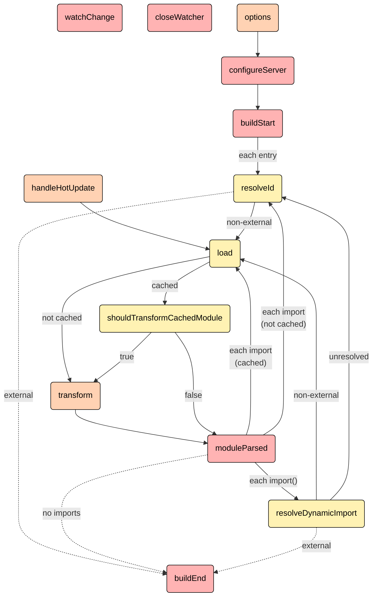

<h1 class="font-500">從 Vite Plugin 出發的編譯器大冒險</h1>

JSDC 2025 - JavaScript 開發者年會


---
class: pl-30 py-30
---

# Alex Liu {.font-500}

Vue / Nuxt / TypeScript

<div class="dark:opacity-80">

  <ul class="text-0.785em [&&]:list-none mt-3 [&_li]:m-0 [&_li]:p-0">
    <li>曜比科技 資深前端工程師</li>
    <li>
      Nuxt Ecosystem Team 成員<br>
      <span class="flex items-center pl-3 space-x-2">
        <ph-arrow-elbow-down-right-duotone class="dark:opacity-50 translate-y-[-0.125em]" />
        <span><Repo name="nuxt/nuxt" hide-owner /> 貢獻者 </span>
        <span><Repo name="mini-ghost/nuxt-svgo-loader" hide-owner /> 作者</span>
      </span>
    </li>
    <li>
      第 16 屆 iThome 鐵人賽 Modern Web 組冠軍<br>
      <span class="flex items-center pl-3 space-x-2">
        <ph-arrow-elbow-down-right-duotone class="dark:opacity-50 translate-y-[-0.125em]" />
        <a href="https://www.tenlong.com.tw/products/9786264143011" target="_blank" class="text-green" >《為你寫的 Vue Components》作者</a>
      </span>
    </li>
  </ul>
</div>


<div class="absolute flex items-center gap-x-4 bottom-30 text-sm">
  <div class="flex items-center space-x-1.5">
    <carbon-user class="dark:opacity-40" />
    <a href="https://mini-ghost.dev/" target="_blank" class="border-none! font-300">mini-ghost.dev</a>
  </div>
  <div class="flex items-center space-x-1.5">
    <ph-threads-logo class="dark:opacity-40" />
    <a href="https://www.threads.com/@minighost.dev" target="_blank" class="border-none! font-300">@minighost.dev</a>
  </div>
  <div class="flex items-center space-x-1.5">
    <ph-github-logo class="dark:opacity-40" />
    <a href="https://github.com/Mini-ghost" target="_blank" class="border-none! font-300">Mini-ghost</a>
  </div>
</div>

---
class: relative
clicks: 2
---

<ViteChip :orbit="$clicks >= 2" class="absolute top-1/2 left-1/2 -translate-y-1/2 -translate-x-1/2" />


<!--
Vite 從 2020 年 4 月推出到現在一直都受到開發社群非常高度的關注，它透過瀏覽器對 ES Modules 原生的支援實現了「按需載入被請求的模組」的功能。比起過去 Webpack 需要完整打包整個專案後才能啟動開發伺服器，速度真的快非常多。

我還記得在 Vite 還沒被導入專案的時後，我早上班的第一件事情是在 terminal 輸入 `npm run start` 然後到樓下早餐，買完早餐回到位置上專案可能都還沒啟動完成。

工作的過程也是改幾行程式碼，存檔，開始滑手機，再改幾行，存檔，再看個影片。可以說 Vite 出來之後，害我少很多混水摸魚的時間。

Vite 雖然是由 Vue 的作者尤雨溪開發的，但如今的 Vite 不僅僅支援 Vue，如果你是寫 React、Svelte、Astro 或是 Angular 都可以使用 Vite 進行開發。

要支援這麼多框架，Vite 的 Plugin 系統扮演了很重要的角色，今天這場分享就要跟大家一起聊解 Vite 的實作，了解 Vite Plugin 的架構， 也會聊聊一些熱門 Vite Plugin 的實作思路，希望能給大家一些啟發。
-->

---
layout: intro
class: text-center
---

<div class="w-16em mx-auto">
  
</div>

<!--
今天的分享我們會專注討論 Vite Plugin 的架構與實作。如果想要對 Vite 底層實作想要更深入研究，非常推薦參考龍哥（高見龍）在 2023 年 iThome 鐵人賽的主題，Vite 原始碼解讀，真的會有非常多的收穫。
-->

---

<h2
  class="relative font-500 transition-all duration-500 w-fit" 
  :class="{ 
    'top-1/2 -translate-y-1/2': $clicks === 0,
    'top-0': $clicks > 0,
  }"
>
  Vite 本質上是一個 Dev Server
</h2>

<div v-click="1">

<div>
  <span class="px-1.5 text-xs dark:text-gray light:text-gray-800 bg-gray/10 rounded">瀏覽器</span>
</div>

```html {*|11}{at:2}
<!doctype html>
<html lang="zh-TW">
  <head>
    <meta charset="UTF-8" />
    <link rel="icon" type="image/svg+xml" href="/vite.svg" />
    <meta name="viewport" content="width=device-width, initial-scale=1.0" />
    <title>Vite Project</title>
  </head>
  <body>
    <div id="app"></div>
    <script type="module" src="/src/main.ts"></script>
  </body>
</html>
```

</div>

<div relative>
  <span v-click="3" transition class="absolute inline-flex items-center gap-2 translate-x-[5.5em]">
    <ph-arrow-down-duotone class="dark:opacity-60" />
    <span class="text-0.75em dark:opacity-80 pt-1">HTTP 請求</span>
  </span>
  <span v-click="4" transition class="absolute inline-flex items-center gap-2 translate-x-[12.5em] dark:text-red light:text-[#a00]">
    <ph-arrow-up-duotone class="dark:opacity-60" />
    <span class="text-0.75em dark:opacity-80 pt-1">main.ts 程式碼（瀏覽器看不懂 TypeScript）</span>
  </span>
</div>

<div v-click="3">

<div>
  <span class="px-1.5 text-xs dark:text-green light:text-green-700 bg-green/10 rounded">Dev Server</span>
</div>

```ts
import { createApp } from 'vue'
import './style.css'
import App from '~/App.vue'

createApp(App).mount('#app')
```

</div>

<!--
Vite 的核心說穿了就是一個 Dev Server，透過瀏覽器對 Dev Server 發出請求後，才去找到哪些模組與對應的檔案需要被載入，進行即時的編譯處理。

要理解 Vite 在做的事情，我們可以從簡單的 index.html 開始出發。

當我們使用瀏覽器開啟一個 index.html，[click] 瀏覽器會發現裡面有一個 `<script>` 標籤，上面的路徑指向 /src/main.ts，瀏覽器會這時會發出一個網路請求，拿回 /src/main.ts 這個檔案。

我們來看看 main.ts 這個檔案裡面有什麼。[click] 

這裡的 main.ts 初始化了一個簡單 Vue 專案，它引入了 Vue 的 createApp、一個 CSS 檔案與一個 Vue Component。

不過如果這時 Vite Dev Server 直接將這個檔案回傳，那瀏覽器肯定會無法執行。

首先，瀏覽器不會知道 from 'vue' 是什麼路徑，無法解析 CSS 檔案，它看不懂 `~` 是什麼意思，也不會知道 `.vue` 是什麼格式的檔案。

所以這時候 Vite Dev Server 要先對 main.ts 進行一些處理，把 main.ts 的內容轉換成瀏覽器看得懂的 JavaScript。
-->

---

# <span class="dark:opacity-50">Vite 如何處理</span> <strong font-800>TypeScript</strong>

<div grid="~ cols-[1.33fr_1fr] gap-3">

<v-click>

````md magic-move 
```ts
import fsp from 'node:fs/promises'
import path from 'node:path'
import http from 'node:http'
import connect from 'connect'

const app = connect()

app.use(async (req, res, next) => {
  // 略
})

http.createServer(app).listen(5173, () => {
  console.log('Dev server running at http://localhost:5173')
})
```

```ts{all|4|7|1,9-12}
import { transform } from 'esbuild'

app.use(async (req, res, next) => {
  const filePath = path.join(process.cwd(), req.url)

  if (filePath.endsWith('.ts')) {
    const code = await fsp.readFile(filePath, 'utf-8')

    const result = await transform(code, {
      loader: 'ts',
      target: 'esnext'
    })

    res.setHeader('Content-Type', 'application/javascript')
    res.end(result.code)
  } else {
    next()
  }
})
```

```ts{1,9-12}
import { transform } from 'rolldown/experimental'

app.use(async (req, res, next) => {
  const filePath = path.join(process.cwd(), req.url)

  if (filePath.endsWith('.ts')) {
    const code = await fsp.readFile(filePath, 'utf-8')

    const result = await transform(filePath, code, {
      loader: 'ts',
      target: 'esnext'
    })

    res.setHeader('Content-Type', 'application/javascript')
    res.end(result.code)
  } else {
    next()
  }
})
```

````

</v-click>

<div class="space-y-2 py-1">
  <v-click at="3">
    <div class="relative p-3 rounded-md border dark:text-white/90 bg-blue5/15 border-blue5/20">
      <strong>解析模組（resolveId）</strong><br />
      <span class="dark:opacity-50">取得模組的實際路徑。</span>
    </div>
  </v-click>

  <v-click at="4">
    <div class="relative p-3 rounded-md border dark:text-white/90 bg-blue5/15 border-blue5/20">
    <strong>載入模組（load）</strong><br />
    <span class="dark:opacity-50">依據解析後的路徑讀取模組檔案內容，取得其原始程式碼字串。</span>
    </div>
  </v-click>

  <v-click at="5">
    <div class="relative p-3 rounded-md border dark:text-white/90 bg-blue5/15 border-blue5/20">
    <strong>轉換模組（transform）</strong><br />
    <span class="dark:opacity-50">對程式碼進行轉換處理，將載入的內容轉成最終 ESM。</span>
    </div>
  </v-click>
</div>

</div>

<!--
所以我們需要來暸解 Vite Dev Server 如何處理 TypeScript 檔案。

雖然這裡的程式碼會是非常非常簡化的版本，但我們還是可以從接下來的程式碼來理解 Vite 是如何運作的。

[click] 我們啟動了一個簡易的 Node Server，使用 fsp 來讀取檔案，使用 path 來進行路徑的解析，並且使用 connect 作為處理 middleware 的工具。

[click]  我們在 middleware 針對不同格式的檔案進行處理，當遇到 TypeScript 檔案時，我們使用 esbuild 來進行轉換。

流程如下：

[click] 首先，先解析檔案真實所在的路徑。
[click] 接著，我們使用 Node 內建的檔案系統 API 來讀取檔案。
[click] 最後，這裡使用 esbuild 來轉換 TypeScript。esbuild 一款用 Go 開發的 web module bundler，他主打的特色之一就是「快」，並且可以支援 JavaScript、TypeScript、TSX … etc.
[click] 另外，如果使用的是 rolldown-vite，整體架構大致上也是相同的。
-->

---

# <span class="dark:opacity-50">Vite 如何處理</span> <strong font-800>CSS</strong>

<div grid="~ cols-[1.33fr_1fr] gap-3">

<div v-click="1">

```ts{|all|2|5|7-12}
app.use(async (req, res, next) => {
  const filePath = path.join(process.cwd(), req.url)

  if (filePath.endsWith('.css')) {
    const code = await fsp.readFile(filePath, 'utf-8')

    const result = `
      const style = document.createElement('style')
      style.setAttribute('type', 'text/css')
      style.textContent = ${JSON.stringify(code)}
      document.head.appendChild(style)
    `

    res.setHeader('Content-Type', 'application/javascript')
    res.end(result)
  } else {
    next()
  }
})
```

</div>

<div class="space-y-2 py-1">
  <v-click at="2">
    <div class="relative p-3 rounded-md border dark:text-white/90 bg-blue5/15 border-blue5/20">
      <strong>解析模組（resolveId）</strong><br />
      <span class="dark:opacity-50">取得模組的實際路徑。</span>
    </div>
  </v-click>

  <v-click at="3">
    <div class="relative p-3 rounded-md border dark:text-white/90 bg-blue5/15 border-blue5/20">
      <strong>載入模組（load）</strong><br />
      <span class="dark:opacity-50">依據解析後的路徑讀取模組檔案內容，取得其原始程式碼字串。</span>
    </div>
  </v-click>

  <v-click at="4">
    <div class="relative p-3 rounded-md border dark:text-white/90 bg-blue5/15 border-blue5/20">
      <strong>轉換模組（transform）</strong><br />
      <span class="dark:opacity-50">對程式碼進行轉換處理，將載入的內容轉成最終 ESM。</span>
    </div>
  </v-click>
</div>

</div>

<!--
接下來我們看看 CSS 的怎麼被處理的，[click] 眾所週知，CSS 是不能直接被引入 JavaScript 裡面的，因此 Vite Dev Server 收到在 main.ts 裡面引入的 CSS 請求後，是必須做一些處理才能讓 CSS 生效。

[click] 首先，先解析檔案真實所在的路徑。
[click] 接著，我們使用 Node 內建的檔案系統 API 來讀取檔案。
[click] 最後，我們將 CSS 包裝成一段 JavaScript 程式碼，這段程式碼會在瀏覽器執行時，動態建立一個 `<style>` 標籤，並將 CSS 內容插入到該標籤中，然後將這個 `<style>` 標籤加入到文件的 `<head>` 中，這樣 CSS 就可以生效了。
-->

---

# <span class="dark:opacity-50">Vite 如何處理</span> <strong font-800>Vue <span v-click>/ React</span> <span v-click>/ Svelte</span> <span v-click>... etc.</span></strong>

<div class="h-full pl-20">
  <div class="h-5/6 pl-4 my-auto" flex="~ col gap-6 justify-center">
    <div v-click class="relative" flex="~ gap-2">
      <ph-tree-structure-duotone class="relative top-1" />
      <div flex="~ col gap-1">
        <div class="text-xl">resolveId</div>
        <div class="dark:opacity-65 text-sm">
          取得模組的實際路徑。
        </div>
      </div>
    </div>
    <div v-click class="relative" flex="~ gap-2">
      <ph-download-simple-duotone class="relative top-1"/>
      <div flex="~ col gap-1">
        <div class="text-xl">load</div>
        <div class="dark:opacity-65 text-sm">
          依據解析後的路徑讀取模組檔案內容，取得其原始程式碼字串。
        </div>
      </div>
    </div>
    <div v-click class="relative" flex="~ gap-2">
      <ph-arrows-counter-clockwise-duotone class="relative top-1"/>
      <div flex="~ col gap-1">
        <div class="text-xl">transform</div>
        <div class="dark:opacity-65 text-sm">
          對程式碼進行轉換處理，將載入的內容轉成最終 ESM。
        </div>
        <div class="grid grid-cols-[max-content_2rem_max-content] gap-y-1 gap-x-4 dark:opacity-65 text-sm pl-4 mt-2">
          <div><ph-check-circle-duotone /> vue/compiler-sfc </div> <ph-arrow-right-duotone/>  <div><ri-npmjs-line/> @vitejs/plugin-vue</div>
          <div><ph-check-circle-duotone /> @babel/preset-react </div> <ph-arrow-right-duotone/> <div><ri-npmjs-line/> @vitejs/plugin-react </div>
          <div><ph-check-circle-duotone /> svelte/compiler </div> <ph-arrow-right-duotone/> <div><ri-npmjs-line/> @sveltejs/vite-plugin-svelte </div>
        </div>
      </div>
    </div>
  </div>
</div>

<!--
接著，我們可以再來看看 Vite 如何處理 Vue、[click] React 跟 [click] Svelte [click] 以及其他框架。

[click] 首先一樣，先解析出模組的實際路徑。
[click] 接著依照解析出來的路徑找到相對應的模組檔案，讀取模組檔案內容，取得其原始碼字串。
[click] 最後，依照不同類型的模組進行轉換處理。Vue 的 SFC 就使用 vue 的 compiler-sfc 講內容轉換為 ES Module，遇到 JSX / TSX 就使用 babel 的 preset-react 將檔案轉換成 ES Module，遇到 Svelte 就使用 svelte 的 compiler 將檔案轉換成 ES Module。如果是其他框架也是如此。

透過前面 TS、CSS、Vue SFC、JSX/TSX 與 Svelte 得範例，我們不難發現 resolveId 與 load 幾乎都是相同的，不同的在於遇到了不同格式的檔案、框架會再用不同的 paser 或是特殊的方法，如 CSS，轉換成 ES Module。
-->

---
class: p-0
---

<div class="relative grid grid-cols-2 h-full">

<div class="pl-2.5rem py-3.5rem">

# Vite Plugin Hooks {.font-500}

```ts
import type { Plugin } from 'vite'

export function VitePlugin (options: Options): Plugin {
  return {
    name: 'vite-plugin-name',

    // 解析模組路徑
    resolveId (id, importer) {},

    // 載入模組內容
    load (id) {},

    // 轉換模組內容
    transform (code, id) {}

    // etc...
  }
}
```
</div>

<div />

<div v-click class="absolute top-0 bottom-0 right-0 w-[calc(50%-1.5rem)] scale-80 -translate-y-1.75em">



</div>

</div>

<!--
所以我們大多時候看到的 Vite Plugin 架構大致會長得像這樣。

Vite Plugin 在設計上通常會以一個 function 回傳一個物件的方式處理，因為這樣 Plugin 就能在使用時接受自定義。

再來就會有我們前面提到的，`resolveId`、`load`、`transform` [click] 以及其他不同階段會用到的 hooks。
-->

---

# 常見的 Vite Plugins 應用 {.font-500}

<div class="grid grid-cols-[max-content_1fr] gap-6 px-20 mt-20">
  <div v-click class="text-end">
    <div><ph-magic-wand-duotone /> 編譯模組</div>
    <div class="dark:opacity-60 text-xs"> Compiler</div>
  </div>
  <div v-click>編譯檔案，包含 JSX、TSX、SFC 等格式的轉換。或是其他自定義的編譯宏（Macros）轉換。</div>
  <div v-click class="text-end">
    <div><ph-puzzle-piece-duotone /> 虛擬模組</div>
    <div class="dark:opacity-60 text-xs">Virtual Modules</div>
  </div>
  <div v-click>引入不存在的模組，可以在程式碼中注入編譯時的資訊。</div>
  <div v-click class="text-end">
    <div><ph-plugs-connected-duotone /> 開發伺服器擴充</div>
    <div class="dark:opacity-60 text-xs">Dev Server Extensions</div>
  </div>
  <div v-click>可以攔截 Vite Plugin 的 Hook、監聽 Dev Server 發出的事件，做到更進階的監控或操作。</div>
  <div v-click class="text-end">
    <div><ph-package-duotone /> 輸出後處理</div>
    <div class="dark:opacity-60 text-xs">Build Output</div>
  </div>
  <div v-click>重寫 chunk、打包後處理、加入版權橫幅、上傳到 CDN 等。</div>
</div>

---
class: grid place-content-center
---

<h2 font-500><ph-magic-wand-duotone /> 編譯模組 Compiler</h2>

---
class: py-10
clicks: 9
---

<h2
  class="relative top-0 font-500 w-fit transition-all duration-500"
  :class="{ 'top-1/2 -translate-y-1/2': $clicks === 0 }"
>
  <mdi-svg class="dark:opacity-50"/> SVG Loader（SVG Component)
</h2>

<v-click>

<p class="opacity-50">將 SVG 檔案作為 Vue 元件載入</p>

</v-click>

<v-click>

```html [vue.svg]
<svg xmlns="http://www.w3.org/2000/svg" width="37.07" height="36" viewBox="0 0 256 198">
  <path fill="#41B883" d="m0 0l128 220.8L256 0h-51.2L128 132.48L50.56 0H0Z"></path>
  <path fill="#35495E" d="M50.56 0L128 133.12L204.8 0h-47.36L128 51.2L97.92 0H50.56Z"></path>
</svg>
```

</v-click>


<div
  transition duration-500
  class="grid grid-cols-[minmax(0,1fr)_min-content_minmax(0,1fr)] items-center gap-2 mt-1"
  :class="{ 'opacity-30': $clicks === 7 || $clicks === 8  }"
>

<v-click>

```ts
import vueBase64 from '~/assets/vue.svg'
```

</v-click>

<v-click>

<ph-arrow-right-duotone class="dark:opacity-60"/>

```text
data:image/svg+xml;base64,PHN2ZyB4bWxucz0iaHR0cDovL3d3dy53My5vcmcvMjAwMC9zdmciIHdpZHRoPSIzNy4wNyIgaGVpZ2h0PSIzNiIgdmlld0JveD0iMCAwIDI1NiAxOTgiPgogIDxwYXRoIGZpbGw9IiM0MUI4ODMiIGQ9Im0wIDBsMTI4IDIyMC44TDI1NiAwaC01MS4yTDEyOCAxMzIuNDhMNTAuNTYgMEgwWiI+PC9wYXRoPgogIDxwYXRoIGZpbGw9IiMzNTQ5NUUiIGQ9Ik01MC41NiAwTDEyOCAxMzMuMTJMMjA0LjggMGgtNDcuMzZMMTI4IDUxLjJMOTcuOTIgMEg1MC41NloiPjwvcGF0aD4KPC9zdmc+
```

</v-click>

<v-click>

```ts
import vueRawString from '~/assets/vue.svg?raw'
```

</v-click>

<v-click>

<ph-arrow-right-duotone class="dark:opacity-60"/>


```text
<svg xmlns="http://www.w3.org/2000/svg" width="37.07" height="36" viewBox="0 0 256 198"><path fill="#41B883" d="m0 0l128 220.8L256 0h-51.2L128 132.48L50.56 0H0Z"></path><path fill="#35495E" d="M50.56 0L128 133.12L204.8 0h-47.36L128 51.2L97.92 0H50.56Z"></path></svg>
```

</v-click>

</div>

<div class="grid grid-cols-[minmax(0,1fr)_min-content_minmax(0,1fr)] items-center gap-2 mt-1">

<v-click>

<div class="grid place-content-center">

<Repo name="jpkleemans/vite-svg-loader" hideOwner />

```ts
import VueComponent from '~/assets/vue.svg?component'
```

</div>

</v-click>

<v-click>

<ph-arrow-right-duotone class="translate-y-0.8em dark:opacity-60"/>


```vue [vue]
<template>
  <svg xmlns="http://www.w3.org/2000/svg" width="37.07" height="36" viewBox="0 0 256 198">
    <path fill="#41B883" d="m0 0l128 220.8L256 0h-51.2L128 132.48L50.56 0H0Z"></path>
    <path fill="#35495E" d="M50.56 0L128 133.12L204.8 0h-47.36L128 51.2L97.92 0H50.56Z"></path>
  </svg>
</template>
```

</v-click>

</div>

<!--
模組編譯除了像是前面我們提到的將 Vue、JSX 或是 Svelte 這類檔案轉譯成 ES Module 外。[click] 我們也可以透過 Vite Plugin 來將不同的檔案，像是 SVG，轉換成我們需要的元件。

[click] 在 Vite 裡面，如果我們直接 import 一個 SVG 檔案，[click] 預設會被轉換成 Base64 的格式。[click]如果在 query string 上加上 raw [click] 則會得到完整的 SVG 「字串」內容。

如果我們想要把這個 SVG 當作一個元件使用可以怎麼做呢？

[click] 在 Vue 裡面，我們可以使用 vite-svg-loader 這個 Vite Plugin，使用這個 Vite Plugin 之後我們只要在 SVG 導入的路徑的 query string 上加上 component，[click] 我們就能夠得到一個含有 SVG 內容的 Vue Component。

這個功能非常的方便，只要設計師出好一包 SVG 檔案，就可以馬上變成 Vue Component，不需要自己一個一個手動貼到 Vue SFC 裡面使用。
-->

---

<div class="grid grid-cols-[min-content_minmax(0,1fr)] gap-4">

```ts {*|5-7|5-7|5-7|5-7|11|12|14-18|20|*}
function Plugin () {
  return {
    name: 'vite-svg-loader',
    load: {
      filter: {
        id: /\.svg\?component$/,
      },
      async handler(id) {
        const [path] = id.split('?')

        let svgContent = await fsp.readFile(path, 'utf-8')
        svgContent = optimize(svgContent).data

        const { code } = compileTemplate({
          id,
          source: svgContent,
          filename: path,
        })

        return `${code}\nexport default { render: render }`
      }
    }
  }
}
```

<div class="[&_ol]:space-y-4 [&_p]:my-1 pl-4">

<v-clicks at="1" depth="2">

1. 檢測路徑是否為 `.svg?component` 結尾

    <ul class="[&&]:list-none [&_li]:ml-0">
      <li class="text-0.875em leading-loose space-x-2 dark:text-green light:text-green-700">
        <ph-check-circle-duotone class="dark:opacity-60"/>
        <span class="dark:opacity-80">~/assets/vue.svg?component</span>
      </li>

      <li class="text-0.875em leading-loose space-x-2 dark:text-amber light:text-amber-600">
        <ph-funnel-x-duotone class="dark:opacity-60"/>
        <span class="dark:opacity-80">~/assets/vue.svg?raw</span>
      </li>

      <li class="text-0.875em leading-loose space-x-2 dark:text-amber light:text-amber-600">
        <ph-funnel-x-duotone class="dark:opacity-60"/>
        <span class="dark:opacity-80">~/assets/vue.svg</span>
      </li>
    </ul>

2. 讀取 SVG 檔案內容
3. 使用 <Repo name="svg/svgo" /> 最小化 SVG 內容
4. 使用 <Npm name="@vue/compiler-sfc" /> 將 SVG 內容轉換為 Vue 的 render function
5. 將轉換後的程式碼包裝成 Vue 元件

</v-clicks>

</div>

</div>

<!--
這是 Vite SVG Load 簡化版的實現。

[click] 首先，我們先檢測檔案 import 的路徑是否符合我們要處理的規則，[click] 這裡我們找如果在引入檔案是 svg 並且在路徑上看到帶有 component 這個 quert string，這才是我們要處理的，[click] 其餘 [click] 都不必去理會。

[click] 接著讀取 SVG 檔案的內容。

[click] 再來使用 SVGO 最佳化 SVG 檔案的內容，SVGO 是一個能讓 SVG 檔案變更小、更乾淨的最佳化工具。

[click] 再接著使用 Vue 拿來轉換 Vue SFC 的 compiler-sfc 將 SVG 內容轉換成 Vue 的 render function。

[click] 最後的最後，將轉換後的程式碼回傳給 Vite，使用者就能在將這個 SVG 檔案以 Vue Component 的方式使用在開發中。

[click] 到這裡，我們就完成了一個簡單的 Vite Plugin 實作了！
-->

---

<h2
  class="relative top-0 font-500 w-fit transition-all duration-500"
  :class="{ 'top-1/2 -translate-y-1/2': $clicks === 0 }"
>
  <mdi-graphql class="dark:opacity-50" /> 最佳化 GraphQL Schema
</h2>

<div v-click="3" class="flex items-center gap-2 dark:text-amber light:text-amber-600 delay-500 mt-4">
  <ph-warning-duotone/> 
  <span>模板字串（Template Literals，樣板字面值）不會被壓縮</span>
</div>

<div 
  transition duration-500
  class="grid grid-cols-[minmax(0,1fr)_min-content_minmax(0,2fr)] gap-x-2 gap-y-2 mt-2"
  :class="{ '-translate-y-[1.5em]': $clicks <= 2 }"
>

<v-click>

```ts [queries.graphql.ts]
import { gql } from 'graphql-request'
export const GetUsers = gql`
  query GetUsers {
    # 這是一段註解
    users {
      id
      name
      email
    }
  }
`
```

</v-click>

<v-click>

<div class="self-center translate-y-1.5em">
  <ph-arrow-right-duotone class="dark:opacity-60" />
</div>

<div>

<div>

```js [queries.graphql-DO61913P.js]
import{g as e}from"./gql-BxQgxVmM.js";const r=e`
  query GetUsers {
    # 這是一段註解
    users {
      id
      name
      email
    }
  }
`;export{r as GetUsers};
```

</div>

</div>

</v-click>

<div />

<v-click at="4">

<div class="col-span-full">

<div class="flex items-center dark:text-green light:text-green-700 space-x-2">
  <ph-thumbs-up-duotone/>
  <span>刪除註解、換行與不必要的空白<span v-click="5">（171bytes <ph-arrow-right-duotone class="-translate-y-px dark:opacity-60" /> 70bytes，減少 <strong class="text-1.5em">59%</strong>）</span></span>
</div>

```js
const r="query GetUsers{users{id name email}}";export{r as GetUsers};
```

</div>

</v-click>

</div>

<!--
我們可以看一個實際應用的案例，這是一個 GraphQL 的 schema，[click] 經過打包壓縮後他會變成這樣，我們可以看到，變數名稱 `GetUsers` 與 `gql` 都被壓縮到只剩下一個字元，但是 GraphQL 的 schema 卻完全沒有任何變化。

[click] Template Literal 裡面的內容幾乎不會被壓縮，這其實是「多數打包／壓縮工具刻意保守」的結果，不是做不到，而是實作成本太大，相較於需要付出的實作成本，實際帶來的收益卻是非常小的。

對打包工具來說，Template Literal 的內容是一個「不帶語言訊息的純資料」，它不知道裡面的字串是 HTML、CSS 還是 GraphQL 的 schema，空白或是換行對應不同的語言可能會有完全不同的含義，有時候甚至是刻意為之，所以在 minify 的過程自然是不太好擅自做壓縮。

[click] 不過在這個範例裡面，GraphQL 的註解（# 字號）、換行與一些空白是可以被刪除的，甚至 `gql` 這個 function 也可能可以被刪除 ，[click] 這樣打包出來的原始檔案甚至可以從 171kb 下降到 70kb，減少了 59% 的 bound size。
-->

---

<div class="grid grid-cols-[minmax(max-content,5fr)_4fr] gap-4">

````md magic-move

```ts {*|1-2,9-12}
const FILE_REGEX = /.graphql.ts$/
const GRAPHQL_REGEX = /gql`[^`]+`/g

export default function () {
  return {
    name: 'vite-minify-graphql',
    enforce: 'pre',
    transform: {
      filter: {
        id: FILE_REGEX,
        code: EXPORT_REGEX,
      },
      handler(code) {
        // implementation
      },
    },
  }
}

```

```ts
const GRAPHQL_REGEX = /gql`[^`]+`/g

function transform(code) {
  const matches = [...code.matchAll(GRAPHQL_REGEX)]

  matches.forEach(matched => {
    const { index, 0: source } = matched

    const code = source
  })
}
```

```ts
const GRAPHQL_REGEX = /gql`[^`]+`/g

function transform(code) {
  const matches = [...code.matchAll(GRAPHQL_REGEX)]

  matches.forEach(matched => {
    const { index, 0: source } = matched

    const code = source
      .replace(/#.*$/gm, '') // 移除註解（# 開頭的行）
  })
}
```

```ts
const GRAPHQL_REGEX = /gql`[^`]+`/g

function transform(code) {  
  const matches = [...code.matchAll(GRAPHQL_REGEX)]

  matches.forEach(matched => {
    const { index, 0: source } = matched

    const code = source
      .replace(/#.*$/gm, '') // 移除註解（# 開頭的行）
      .replace(/\s+/g, ' ') // 將所有空白替換為單一空格
      .replace(/\s*([(),:{}])\s*/g, '$1') // 移除標點周圍的空白
      .replace(/(`)\s+/g, '$1') // 移除反引號後面的空白
  })
}
```

```ts
const GRAPHQL_REGEX = /gql`[^`]+`/g

function transform(code) {  
  const matches = [...code.matchAll(GRAPHQL_REGEX)]

  matches.forEach(matched => {
    const { index, 0: source } = matched

    const code = source
      .replace(/#.*$/gm, '') // 移除註解（# 開頭的行）
      .replace(/\s+/g, ' ') // 將所有空白替換為單一空格
      .replace(/\s*([(),:{}])\s*/g, '$1') // 移除標點周圍的空白
      .replace(/(`)\s+/g, '$1') // 移除反引號後面的空白
      .replace(/^gql/, '') // 移除 gql 標記
  })
}
```
```ts
const GRAPHQL_REGEX = /gql`[^`]+`/g

function transform(code) {
  const ms = new MagicString(code)
  
  const matches = [...code.matchAll(GRAPHQL_REGEX)]

  matches.forEach(matched => {
    const { index, 0: source } = matched

    const code = source
      .replace(/#.*$/gm, '') // 移除註解（# 開頭的行）
      .replace(/\s+/g, ' ') // 將所有空白替換為單一空格
      .replace(/\s*([(),:{}])\s*/g, '$1') // 移除標點周圍的空白
      .replace(/(`)\s+/g, '$1') // 移除反引號後面的空白
      .replace(/^gql/, '') // 移除 gql 標記

    ms.overwrite(index, index + source.length, code)
  })

  return {
    code: ms.toString(),
    map: ms.generateMap({ hires: true })
  }
}
```

````

<v-clicks at="1" depth="2">

1. 只針對檔名稱為 `/.graphql.ts$/` 與內容有 `gql` 的程式碼進行處理
2. 挑出 schema 後 ...
    - 移除註解（# 開頭的行）
    - 移除可以刪除的空白與換行
    - 移除 `gql` 標記
3. 使用 <Npm name="magic-string" /> 修改原始碼，並輸出修改後的程式碼與產出 sourcemap 資訊

</v-clicks>

</div>

<!--
我們可以寫一個 Vite Plugin 來壓縮 GraphQL 的 schema。

[click] 我們要讓目標變得很明確，要準確地找出什麼 Template Literal  可以壓縮，什麼不行。這裡我們指定檔案名稱的中間名是 graphql，並且檔案的內容有 gql 的 Template Literal，才可以被這個 Vite Plugin 處理。

[click] 找到我們要處理的檔案後，我們可以挑出 schema  的部分，進行處理。

[click] 像是刪除 `#` 開頭的註解，[click] 刪除各種可以被刪除的空白與換行，[click] 某些套件提供的 gql 這個 function 會對我們提供的 schema 轉換成 AST 物件，這樣在請求時才能夠在運行時（runtime）排除掉註解等不必要得屬性，在發送請求前又會從 AST 物件轉換回字串。我們在前面已經做完這些處理了，所以這裡就不需要在從字串轉成 AST 再轉回字串，所以我們可以在編譯時（built time）把 `gql` 刪除，只留下字串的部分。這樣就不但可以提高運行時的效率，還可以把 `gql` 這個 function 給 Tree Shake 掉，讓專案最後的 bundl size 耕小。

[click] 現在我們已經得到了改好的程式碼片段，我們可以使用 `magic-string` 這個工具，幫助我們生成修改後的程式碼，並且生成與對應的 sourcemap 檔案。

這樣我們就得到了一個簡易的 GraphQL schema 壓縮工具了！
-->

---
class: grid place-content-center
---

<h2><ph-puzzle-piece-duotone /> 虛擬模組 Virtual Modules</h2>

---

## <ph-puzzle-piece-duotone /> 虛擬模組 Virtual Modules

<v-click at="2">
  <div class="rounded-md dark:text-green light:text-green-700 mt-1 pl-12">
    <ph-arrow-bend-down-right-duotone class="opacity-60" /> 不存在實體檔案、由 Vite Plugin 在記憶體中生成的 ES Module
  </div>
</v-click>

<div
  transition duration-500
  class="grid grid-cols-[max-content_minmax(0,1fr)] gap-3 mt-3"
  :class="{ '-translate-y-2.5em': $clicks < 2 }"
>

<FileTree
  class="bg-black/20 p-4 my-1 rounded h-fit"
  :nodes="[
    {
      name: 'src',
      type: 'folder',
      children: [
        {
          name: 'components',
          type: 'folder',
          children: [
            { name: 'Header.vue', type: 'file' },
            { name: 'Footer.vue', type: 'file' },
          ]
        },
        {
          name: 'locales',
          type: 'folder',
          highlight: $clicks >= 1,
          children: [
            { name: 'tw.js', type: 'file' },
            { name: 'en.yaml', type: 'file' },
            { name: 'ja.json5', type: 'file' },
          ]
        },
        { name: 'main.ts', type: 'file' },
        { name: 'App.vue', type: 'file' },
      ]
    },
    { name: 'vite.config.ts', type: 'file' },
  ]"
/>

<div class="space-y-3">

<div>

````md magic-move

```ts
import { createApp } from 'vue'
import { createI18n } from 'vue-i18n'

import App from '~/App.vue'

import tw from './locales/tw.js'
import en from './locales/en.yaml' // 需要另外裝 Plugin 處理
import ja from './locales/ja.json5' // 需要另外裝 Plugin 處理

const i18n = createI18n({
  locale: 'tw',
  messages: {
    tw,
    en,
  }
})

const app = createApp(App)
app.use(i18n).mount('#app')
```

```ts {6|6}
import { createApp } from 'vue'
import { createI18n } from 'vue-i18n'

import App from '~/App.vue'

import messages from '@intlify/unplugin-vue-i18n/messages'

const i18n = createI18n({
  locale: 'tw',
  messages
})

const app = createApp(App)
app.use(i18n).mount('#app')
```

````

</div>

</div>

</div>

<!--
虛擬模組我們以 vue-i18n 為例，這是 vue-i18n 簡易的使用方式。我們從 `/locales` 裡面載入了各種不同語系的檔案。

[click] 這是我們如果用了 `unplugin-vue-i18n`，我們就可以使用它提供的虛擬模組路徑載入語系檔案。 

[click] 虛擬模組就是一個不存在實體檔案，由 Vite Plugin 在記憶體中動態生成與更新的 ES Module

[click] 現在這個路徑引入的 message 裡面 [click] 就包含了 `tw.js`、`en.yaml` 與 `ja.json`。當然真實專案不太會用到這麼多種不同格式的檔案，這裡只是要表示如果使用了 unplugin-vue-i18n 就可以無痛的使用這些格式的檔案。

[click] 如果我們在 `/locales` 加入了韓文的翻譯檔，虛擬模組也會跟著自動更新。
-->

---

## <ph-puzzle-piece-duotone /> 虛擬模組 Virtual Modules {.font-500}

<div class="grid grid-cols-[max-content_1fr] gap-3">

<div class="!space-y-3" mt-2>


```ts
import { message } from 'virtual:message'
```

<div v-click="1">

```ts {*|*|2-3,7-11|2-3,7-11|2-3,7-11|2-3,7-11|2,3,12-18|2,3,12-18|2,3,12-18|2,3,12-18|*}
export default function VirtualModulePlugin() {
  const VIRTUAL_MODULE_ID = 'virtual:message'
  const RESOLVED_VIRTUAL_MODULE_ID = '\0' + VIRTUAL_MODULE_ID

  return {
    name: 'vite-virtual-module-plugin',
    resolveId(id) {
      if (id === VIRTUAL_MODULE_ID) {
        return RESOLVED_VIRTUAL_MODULE_ID
      }
    },
    load(id) {
      if (id === RESOLVED_VIRTUAL_MODULE_ID) {
        return `
          export const message = 'Hello from virtual module!'
        `
      }
    }
  }
}
```

</div>

</div>

<div>

<div flex="~ col gap-6 justify-center">
  <div v-click="2" class="relative" flex="~ gap-2">
    <ph-tree-structure-duotone class="relative top-1" />
    <div flex="~ col gap-2">
      <div class="text-xl">resolveId</div>
      <div v-click="3" class="dark:opacity-65 text-sm space-x-1">
        <ph-arrow-elbow-down-right-duotone/>
        <span>Vite Plugin 發現路徑 <code>'virtual:message'</code></span>
      </div>
      <div v-click="4" class="dark:opacity-65 text-sm space-x-1">
        <ph-arrow-elbow-down-right-duotone/>
        <span>返回 <code v-mark.circle.orange="5">'\0'</code> + <code>virtual:message'</code></span>
      </div>
    </div>
  </div>
  <div v-click="6" class="relative" flex="~ gap-2">
    <ph-download-simple-duotone class="relative top-1"/>
    <div flex="~ col gap-2">
      <div class="text-xl">load</div>
      <div class="dark:opacity-65 text-sm">
        發現此時的
        <code>id</code> 是 <code>'\0virtual:message'</code> 時，回傳即時生成虛擬模組
      </div>
      <div flex="~ col gap-2" class="[&_code]:border [&_code]:border-dashed [&_code]:border-white/60">
        <div v-click="7" class="dark:opacity-65 text-sm space-x-1">
          <ph-arrow-elbow-down-right-duotone/>
          <span>掃描 <code>/locales</code>，生成 i18n messages。</span>
        </div>
        <div v-click="8" class="dark:opacity-65 text-sm space-x-1">
          <ph-arrow-elbow-down-right-duotone/>
          <span>掃描 <code>/pages</code>，生成路由設定。</span>
        </div>
        <div v-click="9" class="flex dark:opacity-65 text-sm space-x-1">
          <ph-arrow-elbow-down-right-duotone/>
          <span>掃描 <code class="[&&]:border-orange">&nbsp;&nbsp;&nbsp;&nbsp;&nbsp;&nbsp;</code>，生成你要的程式碼。
          </span>
        </div>
      </div>
    </div>
  </div>
</div>

</div>

</div>

<!--
我們來看看虛擬模組應該如和實作，在畫面上我們從 `virtual:message` 引入了一個 `message`，這個 `virtual:` 是 Vite 建議的開頭，用於讓使用者更輕易的識別他是虛擬模組，但並不硬性規定。 
-->

---

<h1 class="text-3rem font-500">Abstract Syntax Tree</h1>

抽象語法樹（AST）

<div class="grid grid-cols-2 gap-4">

<v-click>

```js
const qlieer = '客立樂最貼心的美業預約工具'
```

</v-click>

<v-click>

<div class="-translate-y-5em">

<v-click at="2">
  <div class="rounded-md dark:text-green light:text-green-700 pl-6">
    <ph-arrow-bend-down-right-duotone class="opacity-60 translate-y-0.5em rotate-75" /> 程式碼的結構拆解後，用物件表示出來
  </div>
</v-click>

```json
{
  "program": {
    "type": "Program",
    "body": [
      {
        "type": "VariableDeclaration",
        "kind": "const",
        "declarations": [
          {
            "type": "VariableDeclarator",
            "id": {
              "type": "Identifier",
              "decorators": [],
              "name": "qlieer",
              "optional": false,
              "start": 6,
              "end": 12
            },
            "init": {
              "type": "Literal",
              "value": "客立樂最貼心的美業預約工具",
              "raw": "'客立樂最貼心的美業預約工具'",
              "start": 15,
              "end": 30
            },
            "definite": false,
            "start": 6,
            "end": 30
          }
        ],
        "declare": false,
        "start": 0,
        "end": 30
      }
    ],
    "sourceType": "module",
    "start": 0,
    "end": 30
  },
  "comments": [],
  "errors": []
}
```

</div>

</v-click>

</div>


---
class: space-y-6
---

<div
  class="relative text-center font-500 transition-all duration-800 top-0 translate-y-0 scale-100"
  :class="{
    'top-1/2 -translate-y-1/2 scale-140': $clicks < 1,
  }"
>
  <code>@intlify/unplugin-vue-i18n/messages</code>
</div>

<div v-click="2" p-3 border="~ dashed white/20" rounded class="text-sm space-y-0.5">

<div grid="~ cols-3" place-items-center gap-3>
  <div w-full p-1 rounded text="dark:amber/70 light:amber-800/70 center" border="~ dashed dark:amber/30 light:amber-800/80"> Message AST Object</div>
  <div w-full p-1 rounded text="dark:amber/70 light:amber-800/70 center" border="~ dashed dark:amber/30 light:amber-800/80"> Message AST Object</div>
  <div w-full p-1 rounded text="dark:amber/70 light:amber-800/70 center" border="~ dashed dark:amber/30 light:amber-800/80"> Message AST Object</div>
</div>

<div grid="~ cols-3" place-items-center gap-3>
  <ph-arrow-up-duotone class="dark:opacity-20" />
  <ph-arrow-up-duotone class="dark:opacity-20" />
  <ph-arrow-up-duotone class="dark:opacity-20"   />
</div>

<div grid="~ cols-3" gap-3>
    
```json [tw.js]
{
  "common": {
    "welcome": "歡迎",
  }
}
```

```yaml [en.yaml]
common:
  welcome: "Welcome"
```

```json5 [ja.json5]
{
  common: {
    welcome: "ようこそ",
  }
}
```

</div>

</div>

<VueI18nLifecycle v-click="3" class="col-span-2 scale-60 transform-origin-lt w-[133%]" />

<div class="translate-y-[-1.5em]">

<v-clicks at="6">

- 支援多種不同檔案格式 <sup class="px-1.5 text-xs text-purple bg-purple/15 rounded">Flexible</sup>
- 在 Runtime 不需要再透過 message-compiler 處理 <sup class="px-1.5 text-xs dark:text-green light:text-green-700 bg-green/15 rounded">Tree Shakable</sup>

</v-clicks>

</div>

---
class: p-0 grid grid-cols-[max-content_1fr]
---

<div class="scale-93.5 translate-y-[-0.2em] origin-left-top">

```ts {*|*|*|6-8|6-8|6-8|11|13-16|18-29|*}
export default function (options: { dir: string }): Plugin {
  return {
    name: 'auto-collection-plugins',
    enforce: 'pre',

    resolveId(id) {
      if (id === VIRTUAL_ID) return `\0${VIRTUAL_ID}`
    },

    load(moduleId) {
      if (moduleId !== `\0${VIRTUAL_ID}`) return null

      const paths = fg.sync(['*.ts', '*/index.ts'], {
        cwd: options.dir,
        onlyFiles: true,
      })

      const imports: string[] = []
      const exports: string[] = []
      for (const path of paths) {
        const src = `./${join(options.dir, path)}`
        const variable = genSafeVariableName(src).replace(/_(45|46|47)/g, '_')
        imports.push(genImport(src, variable))
        exports.push(variable)
      }

      return [...imports, `export default ${genArrayFromRaw(exports)}`].join(
        '\n',
      )
    },
  }
}
```

</div>

<div class="py-6 translate-x-[-1em]">

<h2 class="font-500 mb-4"><ph-stack-duotone class="dark:opacity-50" /> Auto Collection Plugins</h2>

<div v-click="1" class="scale-90 origin-left-top mt-4">

```ts
import pinia from './plugins/pinia'
import vue_query from './plugins/vue-query'

export default [pinia, vue_query]
```

</div>

<v-click at="2">

<div class="leading-0">
  <span class="px-1.5 text-xs dark:text-gray light:text-gray-800 bg-gray/10 rounded">使用方式</span>
</div>

<div class="scale-90 origin-left-top">

```ts
import plugins from 'virtual:auto-collection-plugins'

plugins.forEach(plugin => app.use(plugin))
```
</div>

</v-click>

<div class="mt-3 pr-14" flex="~ col gap-6 justify-center">
  <div v-click="3" class="relative" flex="~ gap-2">
    <ph-tree-structure-duotone class="relative top-1" />
    <div flex="~ col gap-2">
      <div class="text-xl">resolveId</div>
      <div v-click="4" class="dark:opacity-65 text-sm space-x-1">
        <ph-arrow-elbow-down-right-duotone/>
        <span>Vite Plugin 發現路徑 <code>VIRTUAL_ID</code></span>
      </div>
      <div v-click="5" class="dark:opacity-65 text-sm space-x-1">
        <ph-arrow-elbow-down-right-duotone/>
        <span>返回 <code>'\0'</code> + <code>VIRTUAL_ID</code></span>
      </div>
    </div>
  </div>
  <div v-click="6" class="relative" flex="~ gap-2">
    <ph-download-simple-duotone class="relative top-1"/>
    <div flex="~ col gap-2">
      <div class="text-xl">load</div>
      <div class="dark:opacity-65 text-sm">
        發現
        <code>id</code> 是 <code>'\0'</code> + <code>VIRTUAL_ID</code> 時，開始準備虛擬模組的內容
      </div>
      <div flex="~ col gap-2" class="[&_code]:border [&_code]:border-dashed [&_code]:border-white/60">
        <div v-click="7" class="dark:opacity-65 text-sm space-x-1">
          <ph-arrow-elbow-down-right-duotone/>
          <span>掃描指定路徑下的檔案</span>
        </div>
        <div v-click="8" class="dark:opacity-65 text-sm space-x-1">
          <ph-arrow-elbow-down-right-duotone/>
          <span>收集路徑與檔案資訊，組合生成程式碼</span>
        </div>
      </div>
    </div>
  </div>
</div>

</div>

---

<span v-click><Repo name="posva/unplugin-vue-router" /> <span class="px-2 py-1 bg-white/10 rounded">definePage</span></span>

<div class="grid grid-cols-[minmax(0,1fr)_min-content_minmax(0,1fr)] items-center gap-2">

<div v-click>

```vue [pages/index.vue]
<script setup lang='ts'>
import HeroBanner from '~/components/HeroBanner.vue'

definePage({
  meta: {
    title: 'JSDC 2025 - JavaScript 開發者年會'
  },
})
</script>
```

```vue [pages/speakers.vue]
<script setup lang='ts'>
import Speaker from '~/components/Speaker.vue'

definePage({
  meta: {
    title: 'JSDC 2025 - 講者列表'
  },
})
</script>
```

</div>

<v-click>

<ph-arrow-right-duotone class="dark:opacity-60" />

<div>

<div class="leading-0">
  <span class="px-1.5 text-xs dark:text-gray light:text-gray-800 bg-gray/10 rounded">使用方式</span>
</div>

```ts
import { routes } from 'vue-router/auto-routes'
```

<div class="leading-0 mt-3">
  <span class="px-1.5 text-xs dark:text-gray light:text-gray-800 bg-gray/10 rounded">虛擬模組內容</span>
</div>

```js
const routes = [
  {
    component: () => import("/src/pages/index.vue"),
    path: "/",
    name: "/index",
    meta: {
      title: "JSDC 2025 - JavaScript 開發者年會"
    },
  },
  {
    component: () => import("/src/pages/speakers.vue"),
    path: "/speakers",
    name: "/speakers",
    meta: {
      title: "JSDC 2025 - 講者列表"
    },
  }
]
```

</div>

</v-click>

</div>

<!--
我們前面舉幾個應用了編譯與虛擬模組的案例，當然這些功能並不會是獨自存在，例如 unplugin-vue-router，它就結合了我們前面講的兩種應用。

以 Vue 開發來說，我們需要定義一份 router 設定檔，定義每個頁面的路徑、使用的元件以及一些 metadata。所以我們規劃路由跟新增頁面時我們需要新增一個 Vue Component，然後到設定檔案裡面加入新的設定。

有用 Nuxt，或是寫 React 在用的 Next.js，都支援使用資料夾結構生成路由設定，unplugin-vue-router 可以讓我們在不是使用 Nuxt 開發，也能使用這個功能。
-->

---
class: grid grid-cols-2 p-0
clicks: 6
---

<UnpluginVueRouterFlow class="size-full" :clicks="0" />

<div
  class="flex flex-col items-center py-10 pr-14 transition-transform duration-1200 scale-98 children:w-full"
  :class="{
    'translate-y-[-2.25em]': $clicks < 6,
  }"
>

<v-click at="1">

````md magic-move {at:6}

```vue
<script setup lang='ts'>
import Speaker from '~/components/Speaker.vue'

definePage({
  meta: {
    title: 'JSDC 2025 - 講者列表'
  },
})
</script>
```

```vue
<script setup lang='ts'>
import Speaker from '~/components/Speaker.vue'
</script>
```

````

</v-click>

<v-click at="2">

<ph-arrow-down-duotone class="dark:opacity-50" />

````md magic-move {at:4}

```js
export const router = [{
  path: '/speakers',
  name: 'speakers'
}]
```

```js
export const router = [{
  path: '/speakers',
  name: 'speakers'
  meta: {
    title: 'JSDC 2025 - 講者列表'
  },
}]
```

````

</v-click>

<v-click at="5">

<div class="mt-2">

```ts [typed-router.d.ts]
declare module 'vue-router/auto-routes' {
  import type { RouteRecordInfo } from 'vue-router'

  export interface RouteNamedMap {
    '/speakers': RouteRecordInfo<'/speakers','/speakers',Record<never, never>,Record<never, never>,| never>,
  }
}
```

</div>

</v-click>

</div>

<!--
unplugin-vue-router 完美結合了我們前面提到的「編譯器宏」與「虛擬模組」兩個概念。讓我們來看看它的工作流程：

首先，這個 Plugin 會監聽 pages 資料夾下的所有 .vue 檔案。

當我們在專案中新增或修改頁面檔案時，Plugin 會自動執行以下步驟：

1. **檔案掃描**: 掃描 pages 資料夾下的所有 .vue 檔案，根據檔案結構生成對應的路由路徑。例如 pages/index.vue 會對應到 "/"，pages/speakers.vue 會對應到 "/speakers"。

2. **編譯器宏處理**: 解析每個 .vue 檔案中的 definePage macro。這個 macro 讓我們可以在頁面組件中直接定義路由的 metadata，像是路由名稱、meta 資訊等。重點是 definePage 在編譯時會被移除，不會出現在最終的程式碼中。

3. **虛擬模組生成**: 將掃描到的所有路由資訊整合後，透過虛擬模組 'vue-router/auto-routes' 提供給應用程式使用。這個虛擬模組會動態生成包含所有路由設定的程式碼。

4. **熱更新**: 當我們新增、刪除或修改頁面時，虛擬模組會自動更新，不需要手動維護路由設定檔。

這樣的設計讓我們只需要專注在頁面開發上，路由設定會自動同步，大幅提升開發效率。
-->

---
layout: intro
class: text-center pb-5
---

## <ph-wrench-duotone /> 推薦工具

---

### <carbon-ibm-watson-discovery/> Vite Plugin Inspect  {.font-500}

<div />


---

###  Unplugin {.font-600}
為不同的建構工具<br />提供一致的 Plugin 接口。

<iframe
  src="https://unplugin.unjs.io/"
    scale-55 origin-top-right absolute right-0 top-0 bottom-0
    w="120%" h="182%"
    border="l main"
    onload="this.style.visibility = 'visible';"
    style="filter:contrast(1.15);visibility:hidden;"
/>

---
class: relative
---

### <ph-tree-duotone class="text-[#329672]" /> AST Explorer {.font-600}
用於探索解析器產生的<br />抽象語法樹 (AST) 的 Web 工具。

<iframe
  src="https://ast-explorer.dev/#eNqrVspRslJKL0osyCjMUdJRKkDhJQN5QCofSFXH5CkoxCjl5fvkJyeWZObnxShZKaQl5hSnxuTVKtUCABEJFlQ="
  scale-55 origin-top-right absolute right-0 top-0 bottom-0
  w="120%" h="182%"
  border="l main"
  onload="this.style.visibility = 'visible';"
  style="filter:contrast(1.15);visibility:hidden;"
/>

<!--
抽象語法樹是什麼？

我們平常寫的程式碼，變數、條件判斷、function，而 function 裡面又可以宣告變數、條件判斷、function，某種程度上看起來就是巢狀的形狀。

但對電腦而言，這些巢狀的結構是沒有意義的，但對於編譯器，或說是電腦來說，它只能看到一連串的字元而已，就像我們前面讀取了 GraphQL 的 schema。如果我們想知道這個檔案裡面有哪些 query schema 或是 mutation schema，並且它們分別依賴了哪些 fragment，編譯器很難單純從這段沒有意義的資串解，為了解決這個問題，我們可以將這段字串轉換成 AST 物件。有了 AST 物件後我們就知道，原來畫面上有一個 query，一個 mutation，這個 mutation 還使用了一個 fragment。
-->

---
layout: intro
class: text-center pb-5
---

# Q&A {.font-hand.italic}

---


---
layout: intro
class: text-center pb-5
---

# Thank you! {.font-hand.italic}
